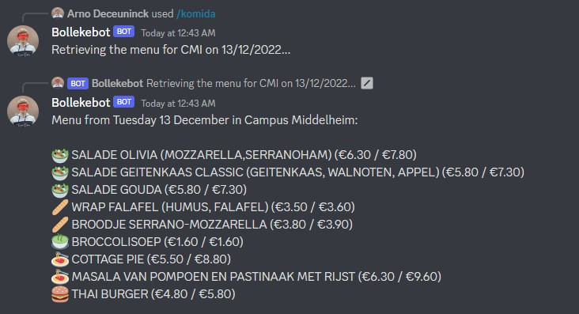

# komida-bot
How to use komida-bot:
- Join a Discord server where komida-bot is in
- Write the command: /komida <location> <date>, e.g. /komida CST tomorrow
  - You can also skip the date if you want the menu of today, e.g. /komida CDE

Feel free to contact me if you have any questions or suggestions.

Image of komida-bot in action:

